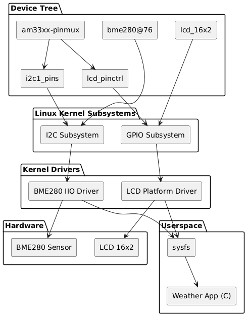
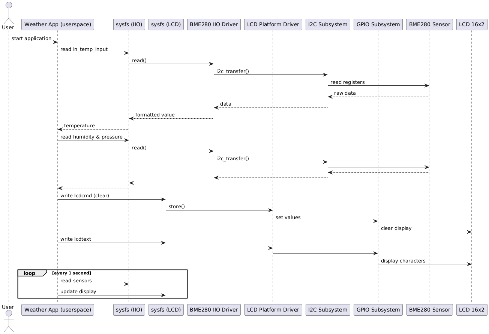

# 🌦️ Embedded Linux Weather Station – BeagleBone Black

This project is part of my learning journey in **Linux Device Driver Development**.  
It demonstrates a complete embedded Linux system, from hardware description using the **Device Tree** to kernel drivers and a userspace application.

Environmental data is collected from a **BME280 sensor** and displayed on a **16x2 LCD**, following a clean and modular Linux architecture with a strict separation between hardware, kernel space, and user space.

---

## Project Overview

The goal of this project is to build a small but realistic embedded Linux system where:
- hardware is described using the Device Tree
- the Linux kernel handles all hardware access
- userspace only interacts with **sysfs interfaces**

At no point does the application access GPIOs or I²C directly.

The global data flow is:

**Hardware → Device Tree → Kernel subsystems → Kernel drivers → sysfs → Userspace application**

---

## Hardware

**Board**
- BeagleBone Black (AM335x)

**Peripherals**
- BME280 environmental sensor (temperature, humidity, pressure)
- LCD 16x2 character display (4-bit mode)

The BME280 sensor is connected to the I²C1 bus with address `0x76`.  
The LCD is driven through GPIOs using a custom Linux platform driver.

---

### Architecture Diagram



---

### Sequence Diagram




## GPIO and Pin Connections

### LCD 16x2 (4-bit mode)

| LCD Signal | BeagleBone Black GPIO |
|----------|------------------------|
| RS | gpio2_2 |
| RW | gpio2_3 |
| EN | gpio2_4 |
| D4 | gpio1_12 |
| D5 | gpio0_26 |
| D6 | gpio1_14 |
| D7 | gpio0_27 |

All GPIOs are configured through **am33xx-pinmux** in the Device Tree.

---

### BME280 (I²C1)

| Signal | BeagleBone Black |
|------|------------------|
| SDA | I2C1_SDA |
| SCL | I2C1_SCL |
| Address | `0x76` |

---

## Device Tree Description

The hardware configuration is defined in `am335x-boneblack-custom.dtsi`.

### Pinmux

The `am33xx-pinmux` node configures:
- GPIO pins used by the LCD through `lcd_pinctrl`
- I²C1 pins through `i2c1_pins`

### LCD Node

The LCD device:
- uses the compatible string `org,bone-lcd`
- references `lcd_pinctrl` for GPIO configuration
- declares all LCD control and data GPIOs
- is bound to a custom platform driver

### BME280 Node

The BME280 device:
- is attached to the `i2c1` bus
- uses the compatible string `bosch,bme280`
- is handled by the standard Linux IIO driver

---

## Kernel Space

### Subsystems
- I²C subsystem for sensor communication
- GPIO subsystem for LCD control

### Drivers
- **BME280 IIO driver** (standard Linux driver)
- **LCD 16x2 platform driver** (custom)

The BME280 driver exposes sensor data through sysfs under the IIO framework.  
The LCD driver exposes sysfs entries to:
- clear the display
- write text
- move the cursor
- scroll the display

---

## Userspace Application

The userspace application is written in **C**.

Its responsibilities are:
- reading temperature, humidity, and pressure from sysfs
- formatting the sensor values
- sending commands and text to the LCD via sysfs
- periodically refreshing the display

### sysfs paths used
- BME280: `/sys/bus/iio/devices/iio:device0/`
- LCD: `/sys/class/bone_lcd/lcd_16x2/`

### Display behavior
- Line 1: temperature and humidity
- Line 2: atmospheric pressure

---

## Build and Run

### Load the LCD driver

```bash
make
insmod lcd_platform_driver.ko
```

Verify:
```bash
ls /sys/class/bone_lcd/lcd_16x2/
```
---

### Verify BME280

```bash
ls /sys/bus/iio/devices/iio:device0/
cat in_temp_input
cat in_humidityrelative_input
cat in_pressure_input
```

### Build and run the application

```bash
make app
.\app.elf
```

### What This Project Demonstrates
- Proper use of the Linux Device Tree
- Platform driver development
- GPIO handling with gpiod
- I²C integration with standard kernel drivers
- sysfs-based kernel/userspace communication
- Clean embedded Linux architecture
